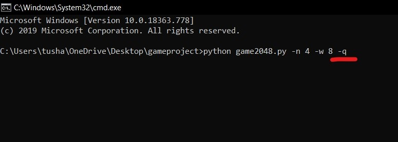
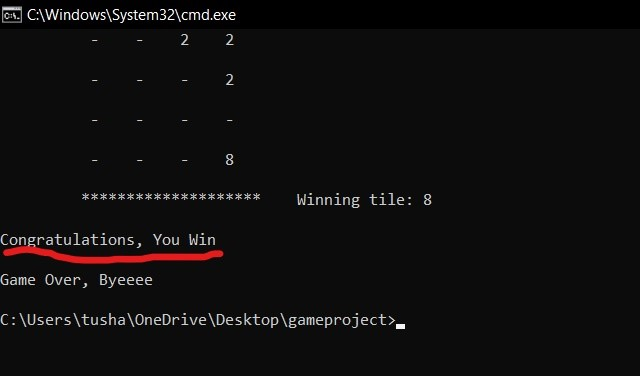
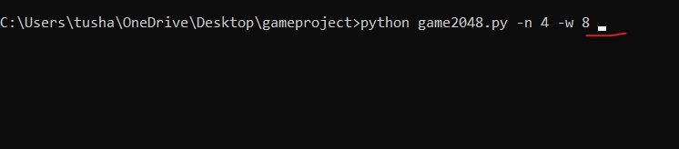
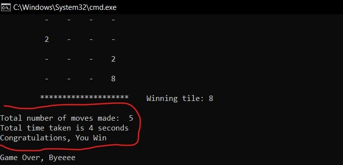

# 2048

### Different inputs include -n, -w and -q :-
- `-n` is for the game size variable.
- `-w` is for the winning tile variable.
- `-q` is for printing only the win or loose message.

Input numbers for game size and winning tile size is taken from command line respectively as **"-n (number)"** and **"-w (number)"**(`-n` and `-w` are shortcut keys for variable game_size and max_tile res.). 

An additional **'quiet'** feature is also there which will decide the format of the result. Shortcut for it is `-q`. 

- If enabled only the win or loose will be printed as result.

    

- If not enabled then additional information like **total time taken** for game and **total number of moves** will also be printed.

    

Note: If not inputed, default values for `game_size` and `max_tile` are 5 and 2048 respectively.

### Moves :-
*WASD* have usual meaning. If *u* key is pressed undo for only one move can be done. 

Note: For quitting game at any point the *z* key can be pressed.

##### Note:
- In order for the progrram to run modules like `numpy`, `argparse`, `pynput`, `time`, `msvcrt` should be installed.
- The progrram runs perfectly in *windows* but I haven't tested it in *linux*.

